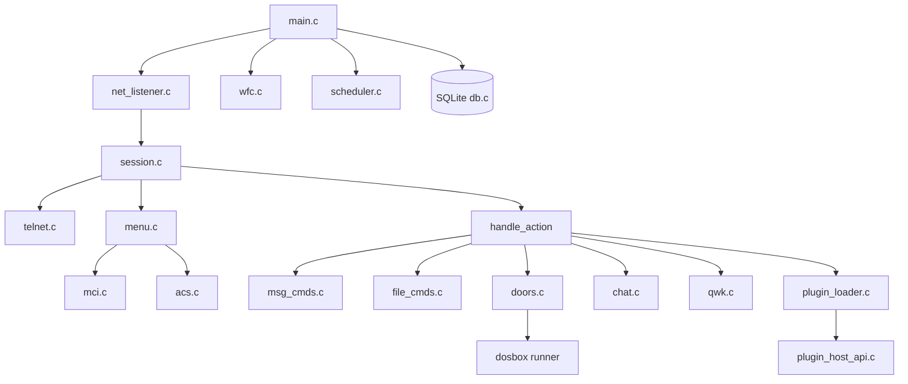

<!-- generated-by: gsd-doc-writer -->

# Architecture

Mutineer BBS is a single-process, multi-threaded telnet server. One main thread accepts connections; each caller gets a dedicated session thread. Background threads run the WFC console and event scheduler. SQLite provides shared persistence with per-thread connections where needed.

## System Overview

```
                    ┌─────────────────────────────────────┐
                    │           mutineer (main)            │
                    │  config.c │ db.c │ log.c │ startup  │
                    └───────────────┬─────────────────────┘
                                    │
         ┌──────────────────────────┼──────────────────────────┐
         │                          │                          │
         ▼                          ▼                          ▼
  net_listener.c              wfc.c                    scheduler.c
  (accept loop)            (sysop console)            (cron events)
         │
         │  spawn per connection
         ▼
  session.c + telnet.c
  (login, menus, actions)
         │
    ┌────┴────┬──────────┬──────────┬──────────┐
    ▼         ▼          ▼          ▼          ▼
 menu.c   msg_cmds.c  file_cmds.c  doors.c   chat.c
 mci.c    qwk.c       fido_netmail  plugin_*  acs.c
```

**Inputs:** Telnet TCP connections, config file, SQLite database, menu/template files, art files, door manifests, plugin `.so` modules.

**Outputs:** ANSI/ASCII terminal streams, log files, dropfiles, QWK/FidoNet/PLANK export queues, chat logs.

## Process Model

### Main Thread (`src/main.c`)

1. Parse `--config` argument (default `conf/mutineer.conf`)
2. Load config via `cfg_load()`
3. Initialize logging (`log_init`)
4. Install signal handlers (SIGINT/SIGTERM stop, SIGUSR1 broadcast trigger)
5. Run `startup_sanity_check()` — verify paths and required files
6. Open database (`db_open`)
7. Run `startup_init_database()` — verify schema and seed data
8. Initialize teleconference (`teleconf_init`)
9. Initialize plugin loader (`plugin_loader_init`)
10. Start WFC thread (`wfc_start`) and scheduler (`scheduler_start`)
11. Enter listener loop (`net_run_listener`) until stop flag set
12. Shutdown: scheduler, WFC, plugins, DB, logs

### Connection Threads

`net_listener.c` accepts TCP connections and spawns a pthread per client (up to 256 nodes tracked in the `nodes` table). Each thread runs `session_run()` which:

1. Assigns a node number
2. Performs telnet option negotiation (`telnet.c`)
3. Runs logon sequence (logon menu, authentication, new user flow)
4. Enters main menu loop
5. On logout: update stats, release node, close socket

### Background Threads

| Thread | Source | Purpose |
|--------|--------|---------|
| WFC | `wfc.c` | Local sysop console showing node grid |
| Scheduler | `scheduler.c` | Poll `events` table, run scheduled/logon/permission events |

PLANK daemons (`plankd`, `coved`) run as **separate processes**, not inside `mutineer`.

## Session Lifecycle

```
Connect → Telnet negotiate → Logon menu → Auth/NewUser
    → Welcome/MOTD → Main menu loop
        → Menu render (MCI expand + ACS filter)
        → User input (key or lightbar)
        → handle_action() or submenu
        → M*/R*/F* commands in message/file mode
    → Logout → Stats update → Node free → Disconnect
```

### Session State (`include/bbs_session.h`)

Key fields carried through the session:

- `user` — current `DbUser` record (level, flags, credits, time)
- `node_num` — assigned node number
- `current_msg_area` / `current_file_area` — active areas
- `current_conf` — active conference (0–25, A=0)
- `batch_queue[]` — file batch download IDs
- `time_left_min`, `credits`, `file_points` — runtime counters
- `expert_mode`, `full_screen_editor` — user toggles

## Component Diagram



## Key Abstractions

| Abstraction | File | Description |
|-------------|------|-------------|
| `BbsConfig` | `include/bbs_config.h` | Runtime configuration struct |
| `Session` | `include/bbs_session.h` | Per-connection state and I/O |
| `BbsDb` | `include/bbs_db.h` | SQLite wrapper with typed queries |
| `Menu` / `MenuItem` | `include/bbs_menu.h` | Parsed menu with ACS and flags |
| `acs_allows()` | `src/acs.c` | ACS expression evaluator |
| `mci_expand()` | `src/mci.c` | MCI template token expansion |
| `handle_action()` | `src/session.c` | Menu action dispatcher |
| `handle_msg_command()` | `src/msg_cmds.c` | M*/R* message commands |
| `handle_file_command()` | `src/file_cmds.c` | F* file commands |
| `door_launch()` | `src/doors.c` | Native and DOSBox door runner |
| `bbs_plugin_desc_t` | `include/bbs_plugin_api.h` | Plugin ABI descriptor |
| `plank_store_t` | `include/plank/plank_store.h` | PLANK object store |

## Source Map

### Core (`src/`)

| File | Responsibility |
|------|----------------|
| `main.c` | Entry point, startup orchestration |
| `config.c` | Config file loading |
| `db.c` | All SQLite operations |
| `session.c` | Session thread, login, menus, `handle_action()` |
| `telnet.c` | Telnet protocol (IAC, NAWS, echo) |
| `net_listener.c` | TCP accept loop, thread spawn |
| `startup.c` | Sanity checks, DB initialization |
| `menu.c` | Menu file parser and renderer |
| `menu_template.c` | ANSI template display with MCI |
| `mci.c` | MCI token expansion |
| `acs.c` | ACS expression parser/evaluator |
| `msg_cmds.c` | Message area commands |
| `file_cmds.c` | File area commands |
| `doors.c` | Door launch (native + DOSBox) |
| `chat.c` | Split chat, teleconference, paging |
| `qwk.c` | QWK packet generation/import |
| `fido_netmail.c` | FidoNet netmail export |
| `wfc.c` | Who's On Full Color console |
| `scheduler.c` | Event scheduler thread |
| `maint.c` | In-BBS maintenance menu actions |
| `hash.c` | Password hashing (PBKDF2/Argon2) |
| `log.c` | File logging |
| `util.c` | String/path/file helpers |
| `plugin_loader.c` | dlopen plugin loading |
| `plugin_registry.c` | Loaded plugin registry |
| `plugin_host_api.c` | Host API implementation for plugins |

### Tools (`src/tools/`)

Standalone binaries sharing `db.c`, `config.c`, etc. See [CLI Tools](cli-tools.md).

### PLANK (`src/plank/`)

| File | Responsibility |
|------|----------------|
| `plank_core.c` | Protocol constants, init |
| `plank_cbor.c` | CBOR encode/decode |
| `plank_crypto.c` | Ed25519/X25519 signing |
| `plank_object.c` | Object envelope handling |
| `plank_store.c` | SQLite object persistence |
| `plank_bundle.c` | Bundle pack/unpack |
| `plank_link.c` | Link session protocol |
| `plank_route.c` | Message routing |
| `plank_policy.c` | Moderation policy enforcement |

### Buccaneer (`src/buccaneer/`)

Lexer, parser, semantic analyzer, bytecode emitter, runtime, host bridge, and `bucc` compiler toolchain. See [Buccaneer](buccaneer.md).

## Data Flow: Menu Selection

1. User presses a key on the main menu
2. `menu_find()` locates the `MenuItem` by key
3. `menu_item_visible()` checks ACS and `CMD_FLAG_HIDDEN`
4. `handle_action(s, item->action)` dispatches:
   - Built-in action string (`messages`, `files`, `logout`, …)
   - `plugin:<id>` for loadable plugins
   - Submenu navigation via `menu` action with data field
5. Action handler reads/writes DB, sends ANSI via `send_str()` / `fd_write_all()`
6. Control returns to menu loop unless `s->alive = 0` (logout)

## Data Flow: Message Post

1. User enters message mode or presses `MP` command
2. `cmd_msg_post()` checks ACS and AC restriction flags
3. Full-screen editor (`fsedit_edit()`) collects subject/body
4. Optional signature/tagline appended from user settings
5. `db_message_post()` inserts into `messages` table
6. Stats incremented; Fido echomail queue populated if area linked
7. PLANK journal entry created if area mapped to PLANK

## Directory Structure Rationale

| Directory | Why |
|-----------|-----|
| `include/` | Public headers consumed by core, tools, plugins |
| `src/` | Implementation; tools and subsystems in subdirs |
| `sql/` | Schema as source of truth for DB layout |
| `menus/` | Operator-editable menu definitions separate from code |
| `art/` | Display art editable without recompile |
| `conf/` | Default config shipped with the project |
| `plugins/` | Sample plugins with isolated build targets |
| `doors/` | Door programs and manifests |
| `tests/` | ctest unit tests and expect integration tests |

## Thread Safety

- Global online user list protected by mutex (`online_*` functions in session.c)
- SQLite connections: main DB handle shared; WAL mode recommended for concurrent readers
- Node table updated on login/logout with status transitions
- WFC reads node state read-only on refresh interval
- Plugin loader initializes once; per-session plugin instances created on demand

## Extension Points

1. **Menu actions** — Add cases to `handle_action()` or invoke via existing command handlers
2. **Plugins** — Shared objects exporting `bbs_plugin_query()`
3. **Buccaneer scripts** — Compiled `.bucc` modules run in the in-process runtime with host bridge
4. **Scheduler events** — DB-driven commands run by `scheduler.c`
5. **PLANK objects** — New object classes via plank subsystem

## Related Documentation

- [Menus and UI](menus-and-ui.md)
- [Messages and Mail](messages-and-mail.md)
- [Doors and Scripting](doors-and-scripting.md)
- [PLANK Networking](networking-plank.md)
- [Reference: Menu Actions](reference/menu-actions.md)
